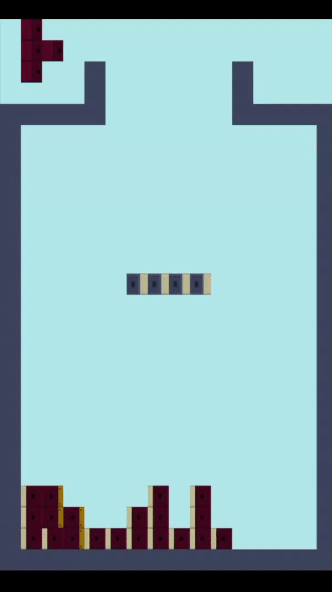
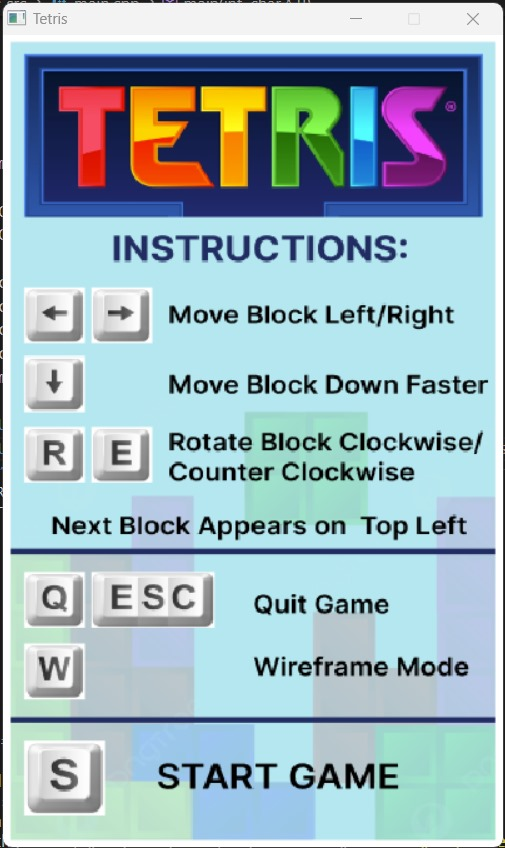
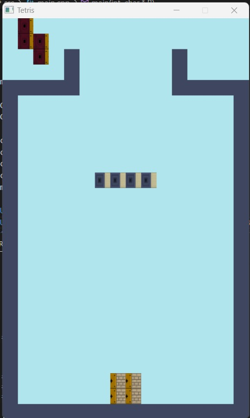
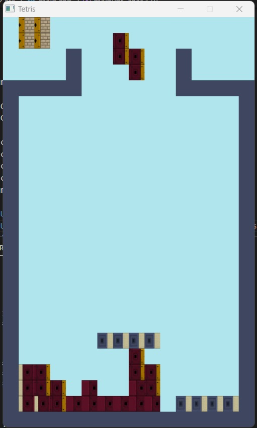
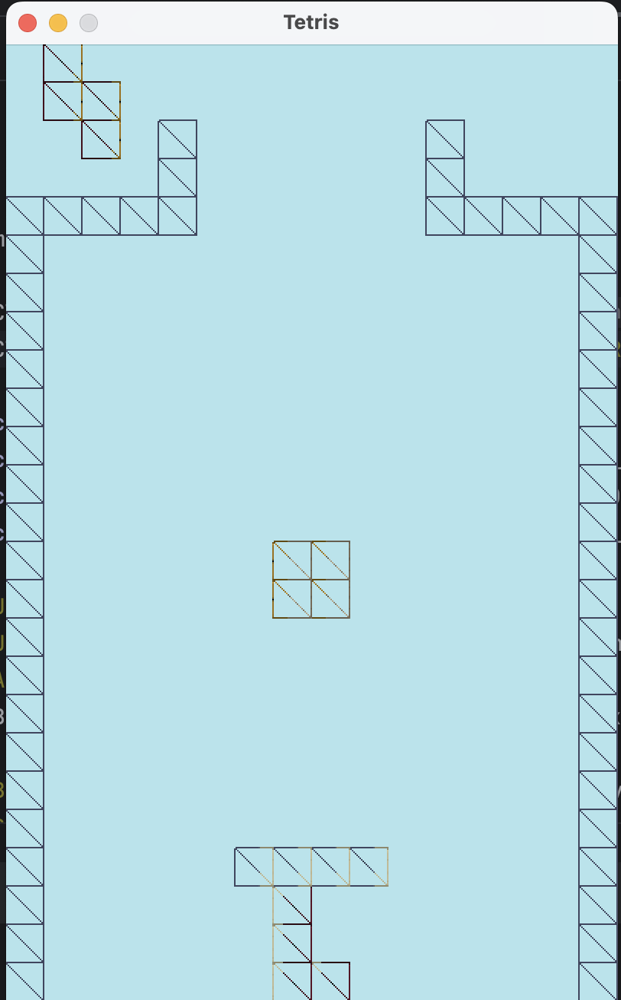
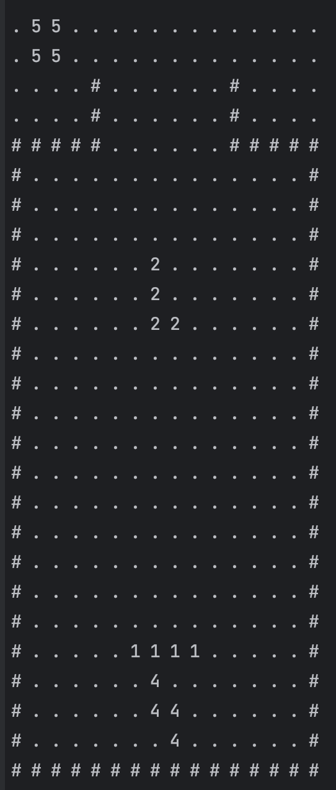
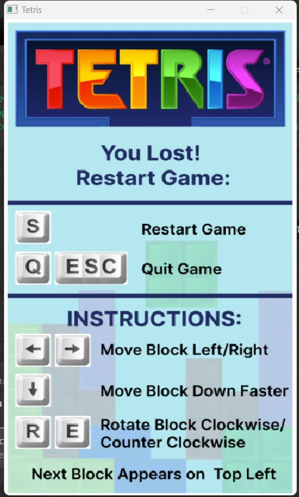

*Disclaimer: The program might run best on windows - AMD machines

## Title: BlockCraft Tetris Adventure using C++ and OpenGL

## YouTube/Dropbox/Drive Link: https://youtu.be/0f0DyfndWPk

## Screenshots and GIFs of the Project:
The game begins with the home screen. 
Upon pressing 'S' the game starts and the user will play. 

Keys needed to play:
* Left and right arrows are used to move the block
* Use 'R' and 'E' are used to rotate it clockwise or anti-clockwise. 
* Down arrow is used to make the block move down faster.

Game Play GIF:
 

When one whole row is filled with no spaces, the line is removed. (GIF)
 

SCREENSHOTS:

Welcome Screen:
 

Game Play:
 

Wireframe mode:
 

Map printed in terminal :
 

Restart Game Screen:
 

